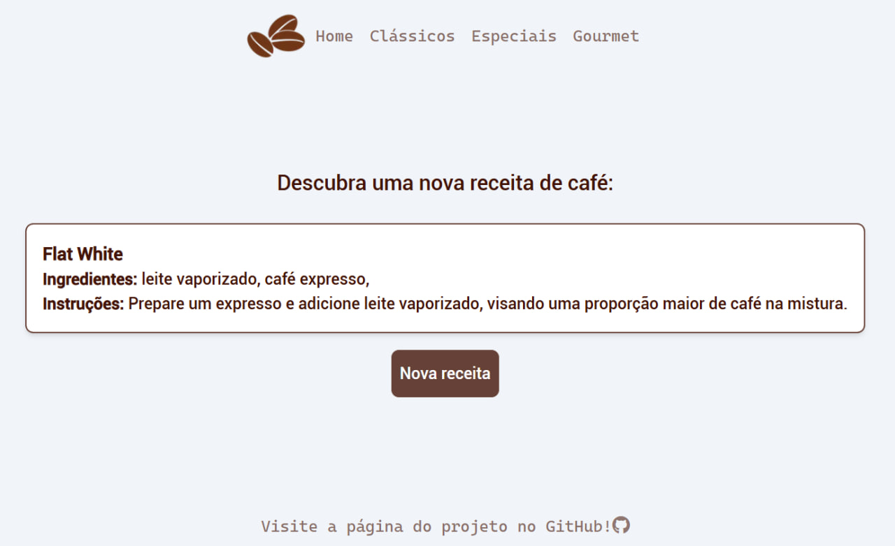

# Descubra Receitas de Café

Pequena aplicação que retorna receitas aleatórias de café buscadas a partir da API:

[API receitas de café](https://coffee-recipes.readme.io/reference/get_)


## Deploy

Para fazer o deploy desse projeto localmente:

```bash
  git clone https://github.com/rebecaaras/coffee-recipes.git
  cd coffee-recipes
```

Instale as dependências:
```bash
yarn install
```

Execute localmente:
```bash
yarn dev
```
Acesse em: http://localhost:3000/

Deploy do site:
[clique aqui!](https://rebecaaras-coffee-recipes.vercel.app/)


## Demonstração



## Stack utilizada

**Front-end:** Next.js, TailwindCSS, shadcn, JavaScript;

**Back-end:** Node, arquitetura MSC;


## Funcionalidades

- Responsivo para telas pequenas;